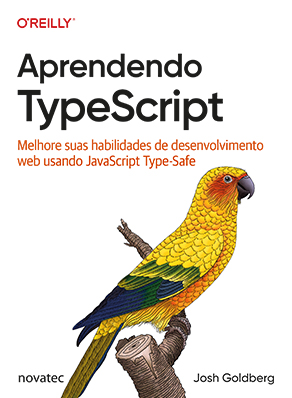

# typescript4noobs

Este projeto é dedicado a todos os estudantes e profissionais da área de tecnologia que desejam iniciar sua jornada no universo TypeScript.

Todos os exemplos mencionados neste artigo podem ser testados no playground online oficial, caso você prefira não baixar nada. Além do mais, o conteúdo desse repositório é baseado na leitura do livro `Aprendendo TypeScript` de Josh Goldberg.

  

> Caso você tenha interesse em adquirir o livro, [acesse este link de afiliado da Amazon](https://amzn.to/3Sp3Kfk)!

## Conteúdo

1. [Do JavaScript ao TypeScript](./conteudo/001-o-que-e-typescript.md)
2. Instalando o TypeScript e configurando o ambiente
3. Introdução ao sistema de tipos
4. Tipos mais comuns
5. Types e Interfaces
6. Classes e Objetos
7. Funções
8. Tipos Avançados
9. Genéricos
10. Decorators

## 👩 Author

| [ <b>@laisfrigerio</b>](https://github.com/laisfrigerio)  |
| :--------------------------------------------------------------------------------------------------------------------------------------------------------------------------------: |

## 📄 License

This project is licensed under the MIT License - see the LICENSE.md file for details
